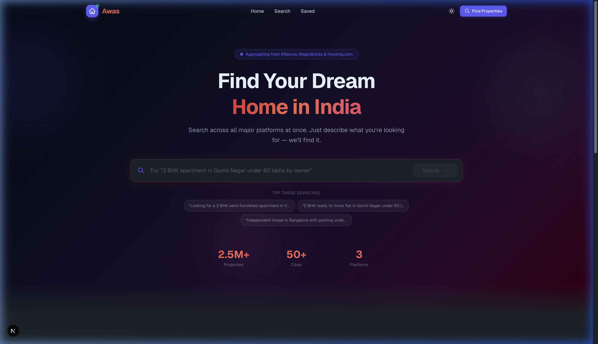
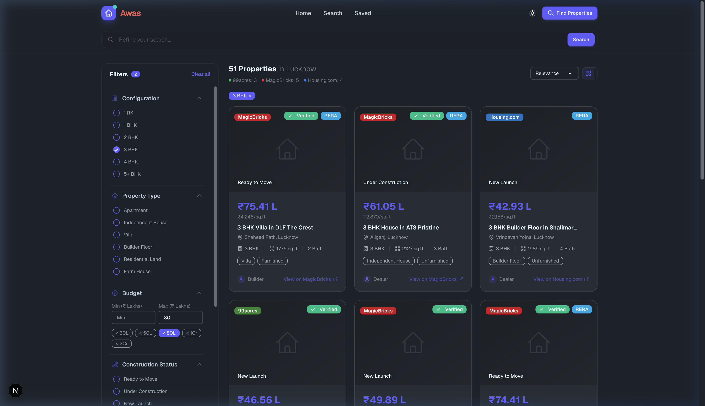

# Awas — India's Smartest Real Estate Search

Awas is an ultra-fast, aggregator-based real estate platform that lets you search across India's largest property networks (99acres, MagicBricks, and Housing.com) simultaneously. Built using Next.js 15, Tailwind CSS v4, and DaisyUI v5.



## Core Features

- **Multi-Platform Scraping**: Concurrently queries 99acres, MagicBricks, and Housing.com, deduping and ranking the listings into a single beautiful feed.
- **Natural Language "Open Query" Search**: Powered by `@rajat19/aiwrap` (Ollama local inference via `gpt-oss:20b`), transforming organic queries like _"3 BHK flat in Gomti Nagar under 80 L by owner"_ into perfectly structured, strict filter payloads.
- **Robust Client & Server State Synchronization**: Guarantees URL parameters strictly match the React state tree, allowing shareable searches. 
- **Adaptive Nord Themes**: Fully reactive DaisyUI themes using the icy "Nord" palette and its "Dim" dark counterpart.



## Installation & Setup

Before running Awas locally, make sure you configure your NPM auth tokens to pull the private [`@rajat19/aiwrap`](https://github.com/rajat19/aiwrap) package.

1. Install dependencies:
```bash
npm install
```

2. Environment Config: Create a `.env.local` to route your NLP prompts correctly:
```env
# AI Parsing Config
OLLAMA_BASE_URL=http://localhost:11434
OLLAMA_MODEL=gpt-oss:20b
AI_PROVIDER=ollama
AI_MODEL=gpt-oss:20b
AI_URL=http://localhost:11434
```

3. Start the dev server:
```bash
npm run dev
```

Visit `http://localhost:3000` or `http://localhost:3001` to use the application!
